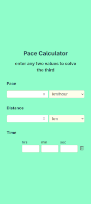

# Pace Calculator

## Application

This is a small PWA application that allows the user to solve for various values and perform what-ifs with respect to pace, distance, and time. 

It is not yet feature complete, but the basics are here.

This is a PWA, and it should be possible to install locally to a device.

### Deploying

1. If you are not deploying to your domains root directory, enter the 'base' property referencing the folder structure the app will reside under. For instance, if the app will live at **my-domain.com/pace**, then enter the following into the **`defineConfig()`** block of the **vite.config.ts** file.

    **`base: '/pace/',`**

1. To build the application, simply execute **`npm run build`** from the root directory. 

## Development

This app is currently developed with Svelte 5.x and Typescript. It uses a [svelte/store](https://svelte.dev/docs/svelte/svelte-store) to hold the basic information used to solve the pace problem, and this is accessed by each of the separate components. There are basic components for each of **Pace**, **Distance**, and **Time**.

## Backlog

- Clear All button
- Save Calculation button
  - save the current calculation to a list at the bottom of the screen for later use/comparison

